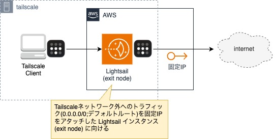

# Tailscale-on-AWS-Lightsail

## 構成図



## 事前準備

1. Tailscale のアカウント作成
2. 管理コンソールの `Settings > Keys > Auth Keys` から auth key を発行
   - Reusable : Off (使い回し不可)
   - Ephemeral : Off (定常的に使う)

## デプロイ

### AWS credentials

```bash
$ cp ./aws/credentials.example ./aws/credentials
# aws/credentials にAWS のアクセスキーを記載
$ code ./aws/credentials
```

### 確認

```bash
docker run --rm -it -v ./aws:/root/.aws amazon/aws-cli \
sts get-caller-identity

{
    "UserId": "XXXXXXXXXXXXXXXXXXXXX",
    "Account": "123456789012",
    "Arn": "arn:aws:iam::123456789012:user/your-iam-user"
}
```


### デプロイ

#### lightsail インスタンスのデプロイ

⚠️ `tskey-xxxxxxxxxxxxxxxxxxxxxxxx` を部分を事前発行した auth key に差し替え

``` bash
docker run --rm -it -v ./aws:/root/.aws -v $(pwd):/aws amazon/aws-cli \
cloudformation deploy \
  --template-file tailscale-lightsail.yaml \
  --stack-name tailscale-exit-node \
  --capabilities CAPABILITY_NAMED_IAM \
  --no-fail-on-empty-changeset \
  --parameter-overrides TailscaleAuthKey=tskey-xxxxxxxxxxxxxxxxxxxxxxxx
```

#### 固定IPのアタッチ

```bash
docker run --rm -it -v ./aws:/root/.aws amazon/aws-cli \
lightsail attach-static-ip \
  --static-ip-name TailscaleStaticIp \
  --instance-name TailScaleExitNode
```

### 削除

#### 固定IPのデタッチ

``` bash
docker run --rm -it -v ./aws:/root/.aws amazon/aws-cli \
lightsail detach-static-ip \
  --static-ip-name TailscaleStaticIp
```


####  lightsail インスタンスの削除
```bash
docker run --rm -it -v ./aws:/root/.aws -v $(pwd):/aws amazon/aws-cli \
cloudformation delete-stack --stack-name tailscale-exit-node
```


